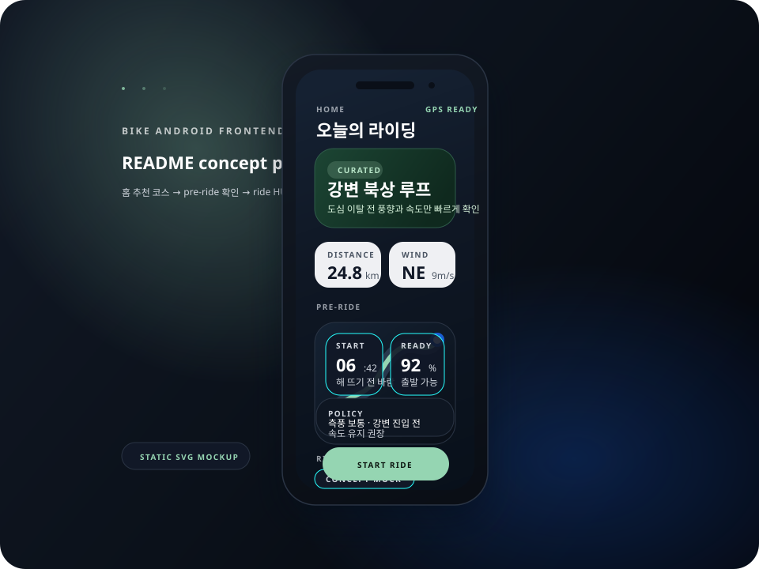

# bike-front

`bike-front`는 GAJA 프로젝트의 Android Native 클라이언트 저장소입니다.

GAJA는 **가벼운 자전거 여행을 위한 주행 HUD 프로젝트**이고,
이 저장소는 그중 홈 진입, pre-ride, ride HUD, 기록 저장, 코스 생성 흐름을 담당합니다.

> Organization: [BIKE-PROJECT-MINJI](https://github.com/BIKE-PROJECT-MINJI)  
> Related repositories: [bike-back](https://github.com/BIKE-PROJECT-MINJI/bike-back)

## Preview



> 위 이미지는 실제 스크린샷이 아닌 README용 concept mock입니다.

## What this repository does

GAJA는 자전거 여행 중 **경로와 상태 정보를 한 화면에서 확인하게 해 외부 앱 재진입을 줄이는 주행 HUD 앱**입니다.

`bike-front`는 그중 아래 경험을 책임집니다.
- 홈에서 빠르게 코스 진입
- 시작 전 맥락 확인(pre-ride)
- 주행 중 경로 / 위치 / 속도 / 날씨 / 정책 경고를 한 화면에서 확인
- 주행 종료 후 기록 저장 및 코스 생성
- 행동 이벤트 수집 지점과 저장 후 상태 UX 처리

## Current scope

### MVP1
- 홈 화면 / 앱 셸
- 추천 코스 목록
- 코스 진입 pre-ride 화면
- 자유 주행 / 코스 따라가기 ride 진입 화면
- 지도 / 현재 위치 / 속도 / 날씨 / 풍향 / 주행 정책 HUD

### Phase 2+
- 주행 종료 후 기록 저장 / 코스 만들기 진입
- 최소 auth/profile 화면
- 코스 초안 편집 화면
- 공개 범위 선택 UI (`비공개 / 링크 공유 / 공개`)
- 실제 `ride-record` 저장 API 호출
- 실제 `course create` API 호출
- 주행 저장 후 processing / failed / regenerate 상태 UX
- Activity 재생성 시 저장/생성 진행 상태 보존

## Main screens

| Area | Entry points |
|---|---|
| Home / App shell | `MainActivity`, `ui/BikeFrontApp.kt` |
| Pre-ride | `ui/screen/CoursePreRideScreen.kt`, `ui/screen/FreeRidePreRideScreen.kt` |
| Ride HUD | `free/FreeRideActivity.kt` |
| Auth / Profile | `auth/AuthProfileActivity` |
| Course editor | `course/CourseEditorActivity` |

대표 사용자 흐름:
1. 홈에서 추천 코스를 본다.
2. pre-ride 화면에서 시작 전 맥락을 확인한다.
3. ride 화면으로 들어가 주행한다.
4. 주행 종료 후 기록 저장과 코스 만들기 흐름으로 이동한다.
5. 로그인 후 코스 초안을 저장한다.

## Current product note

- 현재 앱은 backend-first 흐름에 맞춰 서버 정책/기록/코스 생성을 중심으로 연결됩니다.
- 프론트는 최종 경로를 임의 확정하지 않고, 서버의 저장/후처리 상태를 따라가는 방향으로 정리하고 있습니다.

## Stack

- Android Native
- Kotlin + Jetpack Compose
- Android Gradle Plugin 8.5.2
- compileSdk 35 / targetSdk 35 / minSdk 26
- Java 17
- Navigation Compose
- MapLibre Android SDK

## Module structure

- `ui/`, `ui/screen/`: 앱 셸, 홈, 코스, pre-ride, 내 정보 Compose 화면
- `ridemap/`: 코스 경로 좌표 조회 및 지도 연동
- `ridepolicy/`: 주행 정책 평가 호출
- `weather/`: 날씨/풍향 호출
- `auth/`: 로그인 / 세션 저장
- `course/`: 코스 초안 편집 / 생성 호출
- `config/`: API base URL, 공통 설정

## Local development

### WSL / bash (권장)
```bash
cmd.exe /c gradlew.bat assembleDebug
cmd.exe /c gradlew.bat build
cmd.exe /c gradlew.bat test
```

현재 저장소는 Windows checkout 기반이므로, WSL/bash에서는 `./gradlew`보다 `cmd.exe /c gradlew.bat ...` 경로를 우선합니다.

### Windows PowerShell
```powershell
./gradlew.bat assembleDebug
./gradlew.bat build
./gradlew.bat test
```

## API base URL

- debug 기본값: `http://10.0.2.2:8080`
- 현재 배포 backend 기준 base URL: `http://3.35.168.38`
- release URL은 환경에 따라 gradle property로 덮어씁니다.
- 필요 시 gradle property로 덮어쓸 수 있습니다.

예시:

```powershell
./gradlew.bat assembleDebug -PdebugApiBaseUrl=https://staging.example.com
./gradlew.bat assembleRelease -PreleaseApiBaseUrl=https://api.example.com
```

## Device APK note

- 실제 Android 기기에 debug APK를 설치할 때는 기본 `10.0.2.2` 주소를 그대로 쓰면 안 됩니다.
- 실기기 설치용 debug APK는 접근 가능한 운영 또는 staging URL로 다시 빌드합니다.
- 기본 debug APK 경로: `app/build/outputs/apk/debug/app-debug.apk`

## Current docs

- `DOCS/00_기준/프로젝트_헌법.md`
- `DOCS/00_기준/통합_개발_테스트_방법론.md`
- `DOCS/00_기준/ADR/frontend-mobile/ADR-FM-007_Kotlin_Compose_프론트_전면_전환_선정.md`
- `DOCS/15_기능명세/frontend-mobile/프론트_기능명세_통합.md`

## Notes

- 기능이 추가되거나 제거되면 **Current scope**와 **Main screens**를 함께 갱신합니다.
- README는 계획이 아니라 **지금 실제로 구현된 화면/흐름만** 적습니다.
- 실제 Organization 소개는 org `.github` profile README와 함께 관리합니다.
